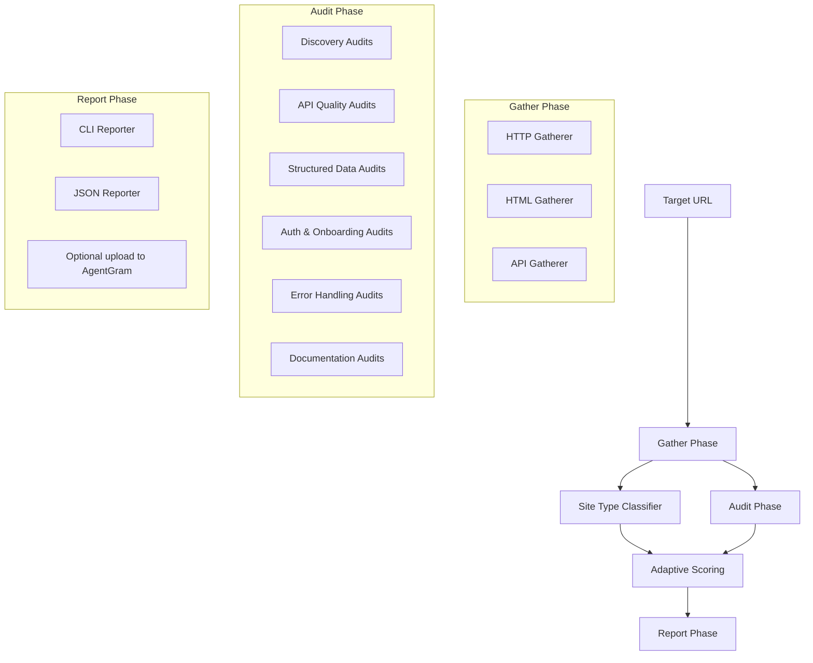

# ax-score Architecture

This document describes the internal architecture of ax-score and how its components interact to produce an AX score.

_Last reviewed: 2026-07-10. Current package version: 0.3.0._

## System Overview

ax-score follows a modular, pipeline-based architecture inspired by Google Lighthouse. The current runner executes a gather → classify → audit → score → report flow; `--repeat` wraps that flow and appends stability metrics.

## Core Components

### 1. BaseGatherer

Gatherers are responsible for collecting raw data from the target. They do not perform scoring.

- **Input**: Target URL and configuration.
- **Output**: Artifacts keyed by gatherer name (for example `http`, `html`, and `api`).
- **Current gatherers**: `HttpGatherer`, `HtmlGatherer`, and `ApiGatherer`.

### 2. Site Type Classifier

The classifier inspects gathered artifacts and assigns the target a site type: `api`, `content`, `hybrid`, or `unknown`.

- **Input**: Gather artifacts from the HTTP/HTML/API passes.
- **Output**: A site type used by `getCategoriesForSiteType()`.
- **Effect**: Content-only sites skip API-only audits and redistribute active category weights so non-API pages are not penalized for irrelevant checks.

### 3. BaseAudit

Audits analyze the artifacts produced by gatherers to determine a score and provide diagnostic information.

- **Input**: Artifacts from gatherers.
- **Output**: Audit result (score 0-1, description, suggestions).
- **Current audit surface**: Discovery, API Quality, Structured Data, Auth & Onboarding, Error Handling, and Documentation.

### 4. Scoring Engine

The scoring engine aggregates individual audit results into categories and calculates the overall score.

- **Algorithm**: Weighted arithmetic mean.
- **Weights**: Defined in `src/config/default.ts` for each category and audit, then adjusted by site type.
- **Recommendations**: Generated from low-scoring audits and attached to the final report.

### 5. Repeat Stability Runner

`runRepeatedAudit(config, repeat)` runs the full audit multiple times when the CLI receives `--repeat <n>`.

- **Input**: The same AX config as a single run plus a positive repeat count.
- **Output**: The latest report with a `stability` block containing run count, scores, min, max, mean, delta, and variance.

### 6. Reporter and Upload

Reporters format the aggregated results for different output targets.

- **CLI**: Human-readable terminal output with colors and spinners.
- **JSON**: Machine-readable format for CI/CD and integration.
- **Upload**: Optional `--upload` sends the report to the AgentGram hosted API using `--api-key` or `AGENTGRAM_API_KEY`.

## How to Add a New Audit

1. **Define the Requirement**: Determine what data is needed and what the scoring criteria are.
2. **Create a Gatherer**: If the data isn't already collected, create a new gatherer in `src/gatherers/`.
3. **Implement the Audit**: Create a new class in `src/audits/` extending `BaseAudit`. Implement the `audit()` method.
4. **Register in Config**: Add the audit reference and its weight to `src/config/default.ts`.
5. **Verify**: Run the CLI against a test site to ensure the audit executes and scores correctly.

## Scoring Algorithm

The overall score is calculated as follows:

1. Each audit produces a score between `0` and `1`.
2. Within a category, the category score is the weighted average of its audits:
   `CategoryScore = Σ(AuditScore * AuditWeight) / Σ(AuditWeight)`
3. The overall score is the weighted average of the category scores:
   `OverallScore = Σ(CategoryScore * CategoryWeight) / Σ(CategoryWeight)`

## Category Weights

| Category          | Weight |
| ----------------- | ------ |
| Discovery         | 25     |
| API Quality       | 25     |
| Structured Data   | 20     |
| Auth & Onboarding | 15     |
| Error Handling    | 10     |
| Documentation     | 5      |

## Integration Patterns

- **CLI**: Direct usage by developers in the terminal.
- **Programmatic**: Importing `runAudit` into other TypeScript/JavaScript projects.
- **CI/CD**: Running ax-score in a GitHub Action or GitLab CI to prevent AX regressions.
- **Web Service**: (Future) A REST API that runs ax-score on demand.
